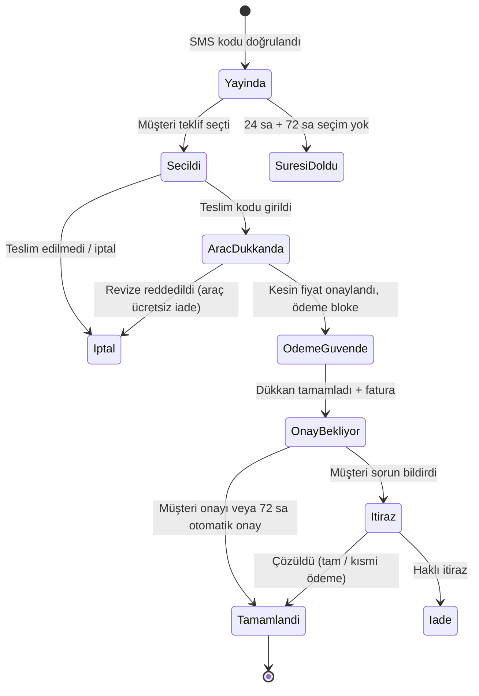

# Ürün akışı, açık noktalar ve karşılıklı kurallar

**Proje:** Araç hasar/arıza için teklif toplama ve güvenli ödeme platformu
**Çalışma adı:** TamirPort (geçici isim, prototipte tek yerden değiştirilebilir)
**Sürüm:** v0.1 taslak · 26 Eylül 2026
**Durum:** Kurallar önerilen varsayılanlardır. Onay bekleyen kararlar [§8](#8-onayınızı-bekleyen-kararlar)'de.

---

## 1. Kısa özet

1. **Misafir kullanıcı, telefon numarası + SMS kodu ile şifresiz bir kimlik edinir.** Üyelik şartı yoktur; üyelik, bu kimliğe e-posta, şifre, araç ve fatura bilgisi eklemektir.
2. **Teklifler talebe özel "Teklif Takip" sayfasında gösterilir.** SMS kodu doğrulanınca bu sayfa otomatik açılır. Kalıcı link SMS ile gider. Başka cihazdan header'daki **Tekliflerim** butonu + SMS kodu ile girilir.
3. **Fotoğrafla verilen fiyat ön tekliftir.** Kesin fiyat araç dükkanda görüldükten sonra netleşir. Dükkanın tek revize hakkı vardır, müşteri revizeyi reddedip aracını ücretsiz geri alabilir.
4. **Ödeme, dükkan seçildiğinde değil, kesin fiyat onaylandığında alınır.** Onarım, ödeme güvenceye alınmadan başlamaz.
5. **Ödeme lisanslı bir ödeme kuruluşunda bloke tutulur.** Karşılıklı onayla dükkana aktarılır; müşteri teslimden sonra 72 saat içinde itiraz etmezse otomatik onaylanır. Komisyon aktarım sırasında düşülür.
6. **İletişim bilgileri (adres, telefon) yalnızca seçimden sonra ve karşılıklı olarak açılır.** Aracın dükkana teslimi ve geri teslim alınması 4 haneli kodlarla kayıt altına alınır.

---

## 2. Aktörler ve ekranlar

| Aktör | Ne yapar | Ekran |
| --- | --- | --- |
| Misafir müşteri | Talep açar, teklifleri karşılaştırır, seçer, öder, onaylar, puanlar | Landing, Teklif Takip |
| Üye müşteri | Yukarıdakiler + araçlarını kaydeder, geçmiş talepler, faturalar, bildirim tercihleri | Müşteri Paneli |
| Dükkan sahibi | Kategorisine ve bölgesine düşen talepleri görür, teklif verir, işi yürütür, hakedişini izler | Dükkan Paneli |
| TamirPort operasyon | Dükkan onayı, uyuşmazlık yönetimi, yorum moderasyonu, komisyon ve ödeme mutabakatı | Yönetim paneli (Faz 2, prototipte yok) |
| Ödeme kuruluşu | Kartla tahsilat, blokeli bekletme, alt üye işyerine (dükkana) aktarım, iade | Entegrasyon |

---

## 3. Uçtan uca akış

### 3.1 Mutlu yol

| # | Kim | Ne olur | Ekran |
| --- | --- | --- | --- |
| 1 | Müşteri | Hasar tespit formunu doldurur: **Araç** (marka, model, yıl, paket) → **Hasar** (kategori, fotoğraf, açıklama) → **İletişim** (ad, soyad, telefon, il/ilçe, KVKK onayı) | Landing |
| 2 | Müşteri | SMS ile gelen 6 haneli kodu girer. Talep yayına girer, talep numarası oluşur, takip linki SMS ile gönderilir | Landing → Teklif Takip |
| 3 | Sistem | Talebi, seçilen kategorilerden en az birine hizmet veren ve hizmet bölgesi talebin ilçesini kapsayan onaylı dükkanlara iletir. Dükkanlar müşterinin adını ve telefonunu görmez | Dükkan Paneli › Gelen talepler |
| 4 | Dükkan | 24 saat içinde kapalı zarf teklif verir: tutar (KDV dahil), süre, parça türü, garanti, kapsam, not | Dükkan Paneli |
| 5 | Müşteri | Teklifleri fiyat, puan, mesafe, süre, parça türü ve garantiye göre karşılaştırır, birini seçer | Teklif Takip |
| 6 | İkisi | Seçimle birlikte dükkanın adresi, konumu ve telefonu müşteriye; müşterinin adı ve telefonu dükkana açılır. Müşteri randevu saatini seçer ve ekranında **Teslim Kodu** görünür | Teklif Takip |
| 7 | Dükkan | Aracı teslim alırken müşterinin söylediği kodu girer, aracın 4 yönden fotoğrafını, kilometresini ve yakıt seviyesini kaydeder | Dükkan Paneli › Aktif işler |
| 8 | Dükkan | Aracı inceler ve **kesin fiyatı** girer: ön teklif geçerli ya da gerekçeli ve fotoğraflı revize | Dükkan Paneli |
| 9 | Müşteri | Kesin fiyatı onaylar ve kartla öder (taksit seçenekli). Para bloke edilir, durum **Ödeme güvende** olur, onarım başlar | Teklif Takip |
| 10 | İkisi | Ek iş çıkarsa dükkan platformdan ek iş talebi açar. Müşteri onaylarsa ek ödeme de aynı şekilde bloke edilir | Teklif Takip / Dükkan Paneli |
| 11 | Dükkan | Onarımı tamamlar: sonrası fotoğraflarını ve faturayı yükler. Müşteriye SMS gider | Dükkan Paneli |
| 12 | İkisi | Müşteri aracı kontrol ederek teslim alır, dükkan müşterinin **Teslim Alma Kodu**'nu girer. 72 saatlik onay süresi başlar | Teklif Takip / Dükkan Paneli |
| 13 | Müşteri | **Onaylıyorum** der ya da süre içinde itiraz etmez. Ödeme komisyon düşülerek dükkana aktarılır (T+1 iş günü) | Teklif Takip |
| 14 | Müşteri | Dükkanı puanlar ve yorum yazar. Puan tablosu güncellenir | Teklif Takip |

### 3.2 Alternatif akışlar

- **Hiç teklif gelmezse:** 24 saat sonunda hizmet yarıçapı genişletilir (ör. 15 → 30 km) ve talep 12 saat daha yayında kalır. Yine teklif gelmezse müşteriye bilgi verilir ve operasyon ekibi arar.
- **Müşteri seçim yapmazsa:** Teklif toplama bittikten sonra 72 saat içinde seçim yapılmazsa talep "Süresi doldu" olur. Talep tek tıkla yeniden yayınlanabilir.
- **Müşteri revize fiyatı reddederse:** Onarım yapılmaz, araç ücretsiz geri verilir. Söküm gerektiren inceleme müşterinin onayıyla yapıldıysa, dükkanın teklifte önceden yazdığı söküm-montaj bedeli uygulanır. Varsayılan bedel 0 ₺'dir.
- **Dükkan seçildikten sonra işi yapamazsa:** Seçim düşer ve müşteriye geçerliliği süren diğer teklifler yeniden açılır. Dükkana ceza puanı yazılır.
- **Müşteri itiraz ederse:** Ödeme bloke kalır ve itiraz akışı işler ([§7.7](#77-uyuşmazlık-ve-garanti)).

### 3.3 Durum diyagramı

| Talep durumu | Müşterinin gördüğü | Süre / limit |
| --- | --- | --- |
| `YAYINDA` | Teklifler geliyor | 24 saat teklif toplama, ardından 72 saat seçim süresi |
| `SECILDI` | Dükkan seçildi | Randevu tarihinden sonra en geç 2 gün içinde teslim |
| `ARAC_DUKKANDA` | Araç dükkanda | Dükkan kesin fiyatı 24 saatte girer, müşteri 48 saatte yanıtlar |
| `ODEME_GUVENDE` | Onarımda | Teklifteki tahmini süre (gecikme bildirilir) |
| `ONAY_BEKLIYOR` | Karşılıklı onay | Teslim alındıktan sonra 72 saat |
| `ITIRAZ` | Sorun bildirildi | Hedef çözüm süresi 7 iş günü |
| `TAMAMLANDI` | Tamamlandı | Değerlendirme için 30 gün |
| `SURESI_DOLDU` / `IPTAL` | Kapandı | - |

**Teklif durumları:** `BEKLEMEDE` → (`GUNCELLENDI`) → `SECILDI` · `SECILMEDI` · `GERI_CEKILDI` · `SURESI_DOLDU`
**Ödeme durumları:** `YOK` → `GUVENDE` (bloke) → `AKTARILDI` · `IADE` · `KISMI_IADE`. Ek iş için ayrı `EK_ODEME` kaydı açılır.

---

## 4. Teklifler nerede gösterilecek? (Misafir kullanıcı UX'i)

**Karar:** Her talebin kendine ait bir **Teklif Takip sayfası** olur. Müşteri akışın her adımını burada görür: teklifler, seçim, randevu, ödeme, onay ve değerlendirme.

**Sayfaya ulaşma yolları**

1. **Otomatik yönlendirme:** SMS kodu doğrulanınca başarı ekranından Teklif Takip sayfasına geçilir. Aynı cihazda oturum 30 gün açık kalır.
2. **SMS linki:** Kısa ve tahmin edilemez bir bağlantı gönderilir (ör. `tamirport.com/t/7KQ2MX`).
3. **Tekliflerim butonu:** Header'da sürekli görünür. Telefon numarası + SMS kodu girilince o numaranın talepleri listelenir. Başka cihazdan veya link kaybolduğunda bu yol kullanılır.
4. **Aktif talep bandı:** Landing'e geri dönen kullanıcı, header'ın altında "Talebin için 4 teklif var" bandını görür.
5. **Müşteri Paneli:** Kullanıcı üye olursa aynı telefonla açılmış tüm talepler otomatik olarak **Taleplerim**'e bağlanır.

**Güvenlik kuralları**

- Link yalnızca görüntüleme yetkisi verir. Teklif seçme, ödeme, onay ve itiraz gibi işlemlerde, cihazda oturum yoksa SMS kodu istenir.
- Linkli sayfada müşterinin adı ve telefonu gösterilmez.

**Bildirim ritmi** (SMS maliyeti ve rahatsızlık dengesi)

- **SMS:** ilk teklif, 3. teklif ya da süre dolumu özeti, randevu hatırlatması, kesin fiyat bildirimi, onarımın bitmesi, otomatik onaydan 24 saat önce.
- **E-posta/push (üyeler):** her yeni teklif, durum değişiklikleri.
- Her teklif için ayrı SMS gönderilmez.

**Neden üyelik şartı yok?** Formun sonunda şifre istemek dönüşümü düşürür. Telefon + SMS kodu hem kimliği doğrular hem de sahte talepleri engeller. Üyelik önerisi, talep tamamlandığında "Aracını kaydet, bir dahaki sefere tek tıkla teklif al" mesajıyla yapılır.

---

## 5. Hasar tespit modülü: alanlar

| Alan | Zorunlu | Not |
| --- | --- | --- |
| Marka, model, yıl | Evet | Model listesi markaya göre gelir |
| Paket (donanım) | Evet | **"Bilmiyorum" seçeneği eklenir.** Çoğu kullanıcı paketini bilmez |
| Arıza kategorisi | Evet (en az 1) | Kaporta, Boya, Mekanik, Elektrik, Döşeme. **Çoklu seçim** (kaza çoğunlukla kaporta + boya) |
| Görsel | Hayır | En fazla 6 fotoğraf. Konum/EXIF verisi silinir |
| Açıklama | Hayır | En fazla 1000 karakter, örnek metinli |
| Araç yürür durumda değil | Hayır | Dükkan teklifine çekici hizmeti ekleyebilir |
| Ad, soyad | Evet | Seçimden önce dükkanlarla paylaşılmaz |
| Cep telefonu | Evet | SMS koduyla doğrulanır. Kimliğin anahtarıdır |
| **İl, ilçe** | **Evet (yeni)** | Brief'te yoktu. Taleplerin dükkanlara bölgeye göre dağıtılması için şart |
| **KVKK aydınlatma + açık rıza** | **Evet (yeni)** | Fotoğraf ve açıklamanın dükkanlarla paylaşılmasına onay |
| Ticari ileti izni | Hayır | İYS kapsamında, ayrı kutucuk |

**SMS kodu kuralları:** 6 hane, 3 dakika geçerli. 60 saniye sonra yeniden gönderilebilir, saatte en fazla 3 gönderim. 5 hatalı denemede 15 dakika kilit. Bir telefonla aynı anda en fazla 3 aktif talep açılabilir.

---

## 6. Açık noktalar ve önerilen çözümler

| # | Tespit | Öneri |
| --- | --- | --- |
| 1 | Formda **konum** yok, talepler bölgeye göre dağıtılamaz | İl + ilçe zorunlu. İleride "Konumumu kullan" eklenebilir. Dükkanın hizmet yarıçapıyla eşleştirilir |
| 2 | **KVKK / ticari ileti izinleri** tanımlı değil | Aydınlatma metni ve paylaşım için açık rıza zorunlu. Ticari SMS izni opsiyonel (İYS) |
| 3 | **Paket** zorunlu ama kullanıcı çoğu zaman bilmiyor | "Bilmiyorum" seçeneği. Faz 2'de plaka/şasi no ile otomatik doldurma |
| 4 | Bir hasar **birden fazla kategoriye** girebilir | Çoklu seçim. Kapsamı eksik teklifler "Kısmi" etiketiyle gösterilir, tam kapsayanlar önce listelenir |
| 5 | **Misafir** kullanıcı teklifleri nerede görecek? | [§4](#4-teklifler-nerede-gösterilecek-misafir-kullanıcı-uxi) |
| 6 | Fotoğrafla **kesin fiyat** verilemez, sürpriz fiyat güveni bozar | Ön teklif + kesin fiyat adımı, tek revize hakkı, müşterinin ret hakkı. Dükkan kartında **teklife sadakat** oranı (işlerin ne kadarı teklif fiyatıyla bitti) |
| 7 | Ödemenin **ne zaman** alınacağı belirsiz | Kesin fiyat onaylandığında, araç dükkandayken. Seçimde alınırsa revizelerde iade ve ek tahsilat karmaşası doğar |
| 8 | Ödemenin **"firmada işletilmesi"** | Başkası adına fon toplamak ve tutmak 6493 sayılı Kanun kapsamında TCMB lisansı gerektirir. Lisanslı bir ödeme kuruluşunun pazaryeri çözümü önerilir: dükkan alt üye işyeri olur, para kuruluşta bloke bekler, onayla dükkana aktarılır, TamirPort komisyonunu alır. Bekleyen para nemalandırılmaz. **Hukuk ve mali müşavir teyidi şart** |
| 9 | Karşılıklı onay verilmezse para **askıda kalır** | Teslim alma kodu + 72 saat sonra otomatik onay + 24 saat kala hatırlatma |
| 10 | **Uyuşmazlık** süreci tanımsız | İtiraz akışı ([§7.7](#77-uyuşmazlık-ve-garanti)) |
| 11 | Onarım sırasında **ek iş** çıkabilir | Yalnızca platformdan ek iş talebi + müşteri onayı + ek ödeme. Platform dışı ek ücret yasak |
| 12 | **Komisyon** modeli belirsiz | Müşteri teklifte gördüğü tutarı öder. Komisyon dükkan hakedişinden düşülür (başlangıç önerisi %10, ödeme altyapısı maliyeti dahil). Taksit vade farkı müşteriye yansır |
| 13 | **Fatura** kimden kime? | Dükkan tam tutar üzerinden müşteriye e-Arşiv/e-Fatura keser ve tamamlama adımında yükler. TamirPort dükkana komisyon faturası keser |
| 14 | **Platform dışına kaçış** (iletişim alınıp dışarıda anlaşılması) | İletişim seçimden sonra açılır. Ödeme güvencesi, garanti takibi ve puan yalnızca platform içi işlerde geçerlidir. İhlal yaptırımları [§7.9](#79-vazgeçme-ve-yaptırımlar) |
| 15 | **Dükkan kabul** kriterleri yok | Vergi levhası, oda/sicil kaydı, adres ve işyeri fotoğrafı, IBAN eşleşmesi, ödeme kuruluşu KYC'si, en az 6 ay işçilik garantisi taahhüdü |
| 16 | **Puan manipülasyonu** ve ilk günlerde puan olmaması | Yalnızca tamamlanmış işler puanlanır. Bayes ortalaması kullanılır. Yeni dükkanlar "Yeni" etiketiyle gösterilir. Tabloya girmek için en az 5 değerlendirme gerekir |
| 17 | **Kasko/sigorta** ile yapılan onarımlar | Faz 1 kapsam dışı (SSS'de belirtilir). Faz 2'de eksper/sigorta entegrasyonu |
| 18 | **Araç yürümüyorsa** ne olacak? | Formda "Araç yürür durumda değil" seçeneği. Dükkan teklifinde çekici hizmetini ve ücretini belirtir |
| 19 | **Faz 1 = sadece landing** mi? | Modül teklif vaat ettiği için Faz 1'de en az talep → teklif → seçim döngüsü ve dükkanın teklif ekranı çalışmalı ([§9](#9-faz-planı)) |
| 20 | Fotoğraflarda **kişisel veri** (plaka, konum) | EXIF/konum silinir. Faz 2'de otomatik plaka bulanıklaştırma |
| 21 | **Sahte ve spam talepler** | SMS kodu, telefon başına en fazla 3 aktif talep, sık iptalde ek doğrulama |
| 22 | **Marka logoları** | Logo kullanımı marka sahiplerinin kurallarına tabidir. Prototipte yazı olarak gösterildi, lansmandan önce hukuki kontrol gerekir |

---

## 7. Karşılıklı kurallar

Aşağıdaki süreler ve oranlar **önerilen varsayılanlardır**. Hepsi yönetim panelinden ayarlanabilir olmalıdır.

### 7.1 Genel

- **G1.** TamirPort müşteri ile dükkanı buluşturan aracı platformdur. Onarım hizmetinin sağlayıcısı dükkandır.
- **G2.** Tüm tutarlar Türk lirası ve KDV dahildir. Müşterinin teklifte gördüğü tutar ödeyeceği tutardır; komisyon dükkan hakedişinden düşülür.
- **G3.** Platformdan gelen işler için platform dışında ödeme alınamaz, ek ücret istenemez.
- **G4.** Adres ve telefon bilgileri yalnızca seçimden sonra ve karşılıklı olarak görünür.
- **G5.** Tüm kritik anlar (teslim, kesin fiyat, ödeme, tamamlama, teslim alma, onay) zaman damgası ve fotoğrafla kayıt altına alınır. Uyuşmazlıkta bu kayıtlar esas alınır.

### 7.2 Talep (müşteri)

- **T1.** Talep yalnızca SMS kodu doğrulandıktan sonra yayınlanır.
- **T2.** Bir telefonla aynı anda en fazla 3 aktif talep açılabilir.
- **T3.** Teklif toplama süresi 24 saattir. Müşteri bu süre dolmadan da seçim yapabilir.
- **T4.** Teklif toplama bittikten sonra 72 saat içinde seçim yapılmazsa talep "Süresi doldu" olur.
- **T5.** Müşteri, dükkan seçene kadar talebini ücretsiz iptal edebilir. Seçimden sonra da aracı teslim edene kadar iptal ücretsizdir.
- **T6.** Müşteri talep yayındayken fotoğraf ve açıklama ekleyebilir. Teklif vermiş dükkanlara bildirim gider.

### 7.3 Teklif (dükkan)

- **D1.** Talep, seçilen kategorilerden en az birine hizmet veren ve hizmet bölgesi talebin ilçesini kapsayan onaylı dükkanlara düşer.
- **D2.** Dükkan teklif aşamasında araç bilgisini, kategoriyi, fotoğrafları, açıklamayı ve ilçeyi görür. Müşterinin adını ve telefonunu görmez.
- **D3.** Teklifler kapalı zarftır: dükkanlar birbirinin fiyatını görmez, yalnızca teklif sayısını görür.
- **D4.** Teklifte zorunlu alanlar: toplam tutar (KDV dahil), tahmini süre (iş günü), parça türü (orijinal / muadil / çıkma / parça gerekmiyor), işçilik garantisi (ay), kapsadığı kategoriler. İsteğe bağlı alanlar: işçilik ve parça kırılımı, not, çekici, söküm-montaj bedeli.
- **D5.** Teklif 7 gün geçerlidir. Dükkan, müşteri seçim yapana kadar teklifini bir kez güncelleyebilir veya geri çekebilir. Güncelleme müşteriye bildirilir.
- **D6.** Bilgi yetersizse dükkan, teklif vermek yerine hazır sorularla ek fotoğraf veya bilgi isteyebilir.

### 7.4 Seçim ve teslim

- **S1.** Müşteri tek bir teklif seçer. Diğer tekliflerin durumu "Seçilmedi" olur ve dükkanlara bildirilir.
- **S2.** Müşteri, dükkanın takviminde açık olan saatlerden randevu seçer. Seçim dükkan için bağlayıcıdır.
- **S3.** Araç, randevu tarihinden sonraki 2 gün içinde teslim edilmezse seçim düşer. Geçerliliği süren diğer teklifler müşteriye yeniden açılır.
- **S4.** Teslim anında dükkan, müşterinin ekranındaki 4 haneli **Teslim Kodu**'nu girer. Ardından aracın 4 yönden fotoğrafını, kilometresini ve yakıt seviyesini kaydeder.
- **S5.** Söküm gerektiren inceleme, müşterinin platform üzerinden onayı olmadan yapılamaz.

### 7.5 Kesin fiyat ve ödeme

- **O1.** Dükkan, aracı teslim aldıktan sonra 24 saat (çalışma saatleri) içinde kesin fiyatı girer.
- **O2.** Kesin fiyat ön tekliften farklıysa revize olur. Revize için gerekçe ve fotoğraf zorunludur, **yalnızca bir kez** yapılabilir ve müşteri onayına tabidir.
- **O3.** Müşteri revizeyi reddederse araç ücretsiz geri verilir. Yalnızca onaylı söküm yapıldıysa teklifte yazan söküm-montaj bedeli alınır.
- **O4.** **Onarım, müşteri kesin fiyatı onaylayıp ödeme bloke edilmeden başlamaz.**
- **O5.** Ödeme kredi veya banka kartıyla 3D Secure üzerinden alınır ve lisanslı ödeme kuruluşunda bloke tutulur. Taksit vade farkı müşteriye yansır.
- **O6.** Ek iş yalnızca platform üzerinden talep edilir (gerekçe + fotoğraf + tutar). Müşteri onaylarsa ek ödeme alınır ve aynı şekilde bloke edilir.
- **O7.** Komisyon, müşterinin ödediği toplam tutar üzerinden hesaplanır ve aktarım sırasında düşülür.
  *Örnek:* 12.450 ₺ onarım → %10 komisyon 1.245 ₺ → dükkana 11.205 ₺.
- **O8.** Dükkan, onarımın tamamını kapsayan faturayı müşteriye keser ve tamamlama adımında sisteme yükler. Fatura yüklenmeden tamamlama bildirilemez.

### 7.6 Tamamlama ve karşılıklı onay

- **K1.** Dükkan "Onarım tamamlandı" bildirimiyle birlikte sonrası fotoğraflarını ve faturayı yükler. Müşteriye SMS gider.
- **K2.** Müşteri aracı teslim almaya geldiğinde aracı kontrol eder. Dükkan, müşterinin **Teslim Alma Kodu**'nu girerek aracı teslim eder.
- **K3.** Müşteri **Onaylıyorum** dediğinde karşılıklı onay tamamlanır ve ödeme dükkana aktarılır (T+1 iş günü).
- **K4.** Teslim alma kodu girildikten sonra 72 saat içinde onay veya itiraz gelmezse ödeme **otomatik onaylanır**. 24 saat kala hatırlatma gönderilir.
- **K5.** Onay geri alınamaz. Sonradan çıkan sorunlar garanti talebiyle ilerler.

### 7.7 Uyuşmazlık ve garanti

- **I1.** Müşteri, onay süresi içinde gerekçe ve fotoğrafla **Sorun bildir** diyebilir. Ödeme itiraz sonuçlanana kadar bloke kalır.
- **I2.** İlk 48 saat dükkanındır: düzeltme veya kısmi iade önerebilir. Müşteri kabul ederse süreç kapanır.
- **I3.** Anlaşma olmazsa TamirPort arabuluculuk yapar. Gerekirse bağımsız eksper görüşü alınır; eksper ücreti haksız çıkan tarafa aittir. Hedef çözüm süresi 7 iş günüdür.
- **I4.** Olası sonuçlar: tam ödeme, dükkanın yeniden işlem yapması, kısmi iade, tam iade.
- **I5.** Onaydan sonra çıkan sorunlar, dükkanın teklifte yazdığı garanti süresi içinde platformdan **garanti talebi** ile iletilir. Dükkan 3 iş günü içinde yanıt verir. Garantiye uymayan dükkanın üyeliği askıya alınır.

### 7.8 Değerlendirme ve puan

- **P1.** Yalnızca tamamlanmış işler değerlendirilebilir ve "Doğrulanmış iş" rozetiyle yayınlanır. Değerlendirme süresi tamamlanmadan itibaren 30 gündür.
- **P2.** Değerlendirmede 1-5 yıldız genel puan ve 4 alt kriter bulunur: işçilik, fiyat/performans, zamanında teslim, iletişim. Yorum ve fotoğraf isteğe bağlıdır.
- **P3.** Dükkan her yoruma bir kez herkese açık yanıt verebilir. Yorumlar silinemez; hakaret veya kişisel veri içerenler moderasyonla kaldırılır.
- **P4.** **Firma puanı** Bayes ortalamasıyla hesaplanır: az değerlendirmeli dükkanlar genel ortalamaya çekilir, son 12 ayın ağırlığı daha yüksektir. Puan tablosuna girmek için en az 5 değerlendirme gerekir.
- **P5.** "Önerilen" sıralaması fiyat, puan, mesafe, teklife sadakat ve yanıt hızının birleşimidir. Sıralamanın mantığı müşteriye açıklanır.
- **P6.** Dükkanın müşteriyi değerlendirmesi (randevuya gelmedi, iletişim vb.) herkese açık değildir. Güven skorunda kullanılır.

### 7.9 Vazgeçme ve yaptırımlar

| Durum | Müşteri | Dükkan |
| --- | --- | --- |
| Seçimden önce | Ücretsiz iptal | Teklif geri çekme serbest |
| Seçimden sonra, teslimden önce | Ücretsiz iptal. 90 günde 2 kez randevuya gelmezse güven skoru düşer | İptal = ceza puanı. Diğer teklifler müşteriye yeniden açılır |
| Araç dükkanda, ödemeden önce | Ücretsiz geri alır (onaylı söküm bedeli hariç) | Kesin fiyatı 24 saatte girmezse hatırlatma, 48 saatte operasyon arar |
| Ödemeden sonra | Yalnızca itiraz veya operasyon üzerinden | Yalnızca operasyon üzerinden. Yapılan iş belgelenir |

**Dükkan yaptırımları:** 90 günde 3 ceza puanı → listelemede geri sıraya düşme. Platform dışı ödeme veya müşteriyi yönlendirme tespiti: 1. uyarı, 2. 30 gün askı, 3. üyelik iptali.

### 7.10 Dükkan üyeliği

- **U1.** Dükkan, doğrulama tamamlanmadan teklif veremez. İstenenler: vergi levhası, esnaf/ticaret sicil kaydı, işyeri adresi ve fotoğrafları, dükkan adına IBAN, ödeme kuruluşu alt üye işyeri kaydı, hizmet kategorileri, çalışma saatleri ve hizmet bölgesi.
- **U2.** **Anlaşmalı firma** rozeti için doğrulama, imzalı sözleşme ve en az 6 ay işçilik garantisi taahhüdü gerekir.
- **U3.** Puanı 3,5'in altına düşen veya itiraz oranı yüksek olan dükkanlar incelemeye alınır.
- **U4.** Dükkan, kapasitesi dolduğunda **Teklif almaya açık** anahtarını kapatabilir.

---

## 8. Onayınızı bekleyen kararlar

| Karar | Önerimiz | Alternatifler |
| --- | --- | --- |
| Komisyon oranı ve kimden alınacağı | %10, dükkan hakedişinden | Kategori bazlı oran · müşteriden ayrıca hizmet bedeli |
| Ödeme anı | Kesin fiyat onayında | Seçimde kart provizyonu (bloke) |
| Ödeme altyapısı | Lisanslı ödeme kuruluşunun pazaryeri çözümü (iyzico, PayTR, Param gibi sağlayıcılar karşılaştırılmalı) | Uzun vadede kendi ödeme kuruluşu lisansı |
| Teklif toplama süresi | 24 saat | 12 veya 48 saat |
| Otomatik onay süresi | Teslimden sonra 72 saat | 48 saat · 7 gün |
| Taksit vade farkı | Müşteriye yansır | Dükkanla paylaşılır · kampanyalı taksit |
| Çoklu kategori | Evet, eksik kapsamlılar "Kısmi" etiketli | Talep başına tek kategori |
| Revize kuralı | Tek revize, her durumda müşteri onayı | Belirli bir orana (ör. %10) kadar otomatik |
| Minimum garanti | 6 ay işçilik | Zorunlu değil, yalnızca gösterilir |
| Lansman bölgesi | Tek şehirle başlamak (ör. İstanbul Anadolu yakası) | Tüm Türkiye |
| Misafir mi, üyelik mi? | Misafir (telefon + SMS kodu), üyelik isteğe bağlı | Ödeme adımında üyelik zorunlu |

---

## 9. Faz planı

| Faz | Kapsam |
| --- | --- |
| **Faz 1a: Lansman** | Landing page (9 bölüm) · hasar tespit modülü + SMS kodu · Teklif Takip sayfası (misafir) · teklif karşılaştırma ve seçim · iletişim bilgisi + randevu · Dükkan Paneli lite (gelen talepler, teklif ver, aktif işler) · yönetim: dükkan onayı |
| **Faz 1b: Güvenli ödeme** | Ödeme kuruluşu entegrasyonu · teslim/teslim alma kodları · kesin fiyat ve revize · karşılıklı onay + otomatik onay · komisyon ve hakediş · fatura yükleme |
| **Faz 2** | Müşteri Paneli (üyelik, Garajım, faturalar) · değerlendirme ve puan tablosu (gerçek veriyle) · itiraz yönetimi · yönetim paneli · ek iş talebi · e-posta/push bildirimleri |
| **Faz 3** | Kasko/sigorta ve eksper entegrasyonu · çekici/vale hizmeti · fotoğraftan yapay zekâ ile hasar ön tespiti · plaka ile araç bilgisi doldurma · mobil uygulama |

> **Not:** Puan tablosu Faz 1'de gerçek veri olmadan boş kalır. Lansmanda anlaşmalı firmalar "Yeni" etiketiyle listelenir, tablo yeterli değerlendirme birikince açılır.

---

## 10. Prototip

Prototip bu klasördedir ve örnek verilerle çalışır. Girilen bilgiler hiçbir yere gönderilmez, yalnızca tarayıcının yerel deposunda tutulur. Ekranlar:

| Ekran | Dosya | Gösterdiği |
| --- | --- | --- |
| Ana sayfa | `index.html` | 9 bölüm, hasar tespit sihirbazı, SMS kodu simülasyonu, Tekliflerim girişi |
| Teklif Takip | `talep.html` | Teklif listesi, karşılaştırma, seçim, randevu, teslim kodu, kesin fiyat/revize, güvenli ödeme, onarım, karşılıklı onay, itiraz, değerlendirme |
| Dükkan Paneli | `dukkan-paneli.html` | Kategoriye göre filtrelenmiş talepler, teklif formu (komisyon ve net hakediş hesabı), aktif işler, hakedişler, değerlendirmeler, profil |
| Müşteri Paneli | `musteri-paneli.html` | Taleplerim, Garajım, ödemeler, değerlendirmeler, bildirim tercihleri |
| Akış ve kurallar | `akis.html` | Bu dokümanın görsel özeti ve ekran haritası |

Uçtan uca denemek için:

1. Ana sayfada formu doldurup SMS kodunu girin.
2. Teklif Takip sayfasında teklifleri inceleyin.
3. Başka bir sekmede Dükkan Paneli › Gelen talepler'den kendi teklifinizi verin; teklif müşteri sayfasına düşer.
4. Kendi teklifinizi seçin ve adımları iki taraftan ilerletin. Sağ alttaki **Prototip kontrolleri** ile adımları tek sayfadan da atlayabilirsiniz.
